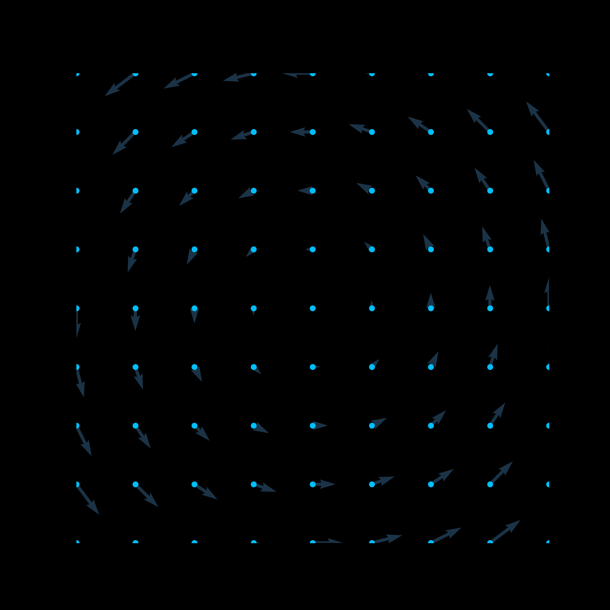

# ODEA-python-solver
Resuelve un sistema de ecuaciones diferenciales de primer orden acopladas mediante el método de Euler para resolver ecuaciones diferenciales ordinarias.

El programa permite ecuaciones no lineales, la unica restriccion es que deben ser estaticas en el tiempo y de primer orden.

## Instrucciones de uso
Si bien se viene con una configuracion por defecto, lo ideal es que al ejecutarlo, podamos personalizar el como aparecen.
Por lo que tenemos distintos argumentos

* `-v` o `--video` nos permite guardar la animacion en un archivo con el formato de nuestro gusto:
`python3 script.py --video file.mp4`
* `-x` o `--fx` es la ecuacion diferencial del eje x, permite x,y, las funciones son las de numpy. Ejemplo: `python3 script.py --fx "np.cos(x*y)"`
* `-y` o `--fy` es exactamente igual que con el punto anterior pero para el eje y. Ejemplo: `python3 script.py --fy "np.sin(x*y)"`
* `-s` o `--fps` son los fps para el modo video
* `--ti` `--tf` son el tiempo inicial y final de la simulacion
* `--n_time_steps` es el numero de fotogramas que se van a hacer en el intervalo de tiempo
* `--n_points` es el numero de particulas a mostrar(o puntos)
* `-m` y `-M` es el rango minimo y maximo respectivos en que se va a mostrar la animacion
## Ejemplos de uso
Codigo:

`
python3 script.py --ti 0 --tf 1 --fx "- y" --fy "x"  --n_time_steps 200 -m -1 -M 1 --fps 32 video1.gif
`

Codigo:

`
python3 script.py --ti 0 --tf 5 --fx "y" --fy "x-x**3"  --n_time_steps 300 -m -2 -M 2 --fps 64 --video video2.gif
`
